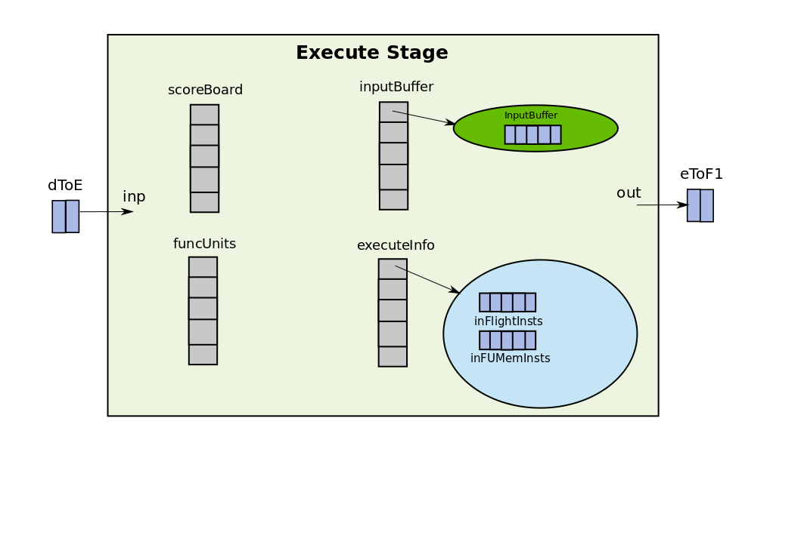
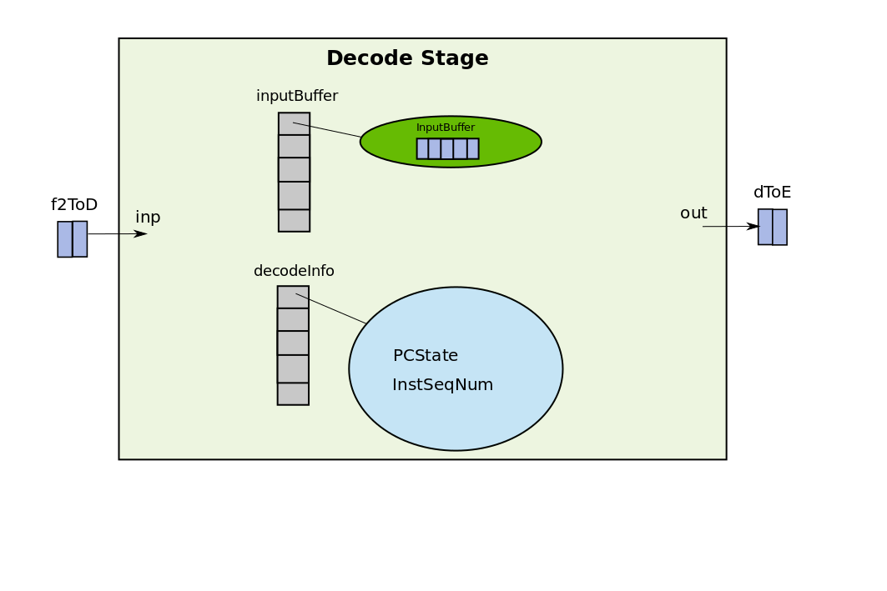
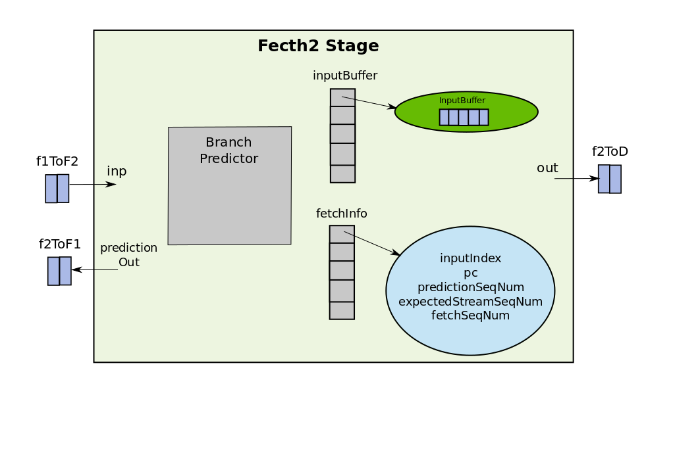

+++
highlight = true
math = false
date = "2017-07-10T10:09:32-04:00"
title = "A Tutorial on the Gem5 Minor CPU Model"
tags = ["gem5"]

[header]
  caption = ""
  image = ""

+++

This is an introduction tutorial on gem5 minor cpu model. 

Many a times it gets difficult for the computer architects to get started with event-driven simulators. This document is written to target that audience and provide an overview of the minor cpu model in gem5 which implements an in-order pipelined processor. If you have never worked on event-driven simulators and don't know what they are, there is a cool video [here](https://www.youtube.com/watch?v=irbshkdVFao). This tutorial will help the reader to understand how the event-driven minor cpu model is implemented in gem5 and will not go much into details of how to compile and build gem5, how to add tracing and what are ports and how do they work. This information can be found in [Learning Gem5](http://learning.gem5.org/book/index.html). OK!! So lets get started. 

<!--more-->

# Minor CPU

## Pipeline
It is a 4 stage pipelined processor. The four stages being fetch1, fetch2, decode and execute. As opposed to 5-stage DLX pipeline that every computer architecture student is familiar with, this is somewhat different. The ITLB access, and fetch of the instruction from the main memory are done in fetch1. fetch2 is responsible for decoding the instruction, decode is responsible for just some book-keeping ( why this is a stage I am not sure at this point ) and execute implements the logic for issue, execute, memory, writeback and commit. All of these stages are defined as SimObjects in the class Pipeline which implements the entire pipeline. The different pipeline stages are connected via Latches ( we will talk about their implementation later in this tutorial ).  

```c++
class Pipeline {
    /* Latches to connect the stages */
    Latch<ForwardLineData> f1ToF2;  
    Latch<BranchData> f2ToF1;
    Latch<ForwardInstData> f2ToD;
    Latch<ForwardInstData> dToE;
    Latch<BranchData> eToF1;

    /* Pipeline Stages */
    Execute execute; 
    Decode decode;     
    Fetch2 fetch2;
    Fetch1 fetch1

    /* Action to be performed at each cycle (tick) */
    void evaluate();
}
```

## Execute
The way to think about an object/class is in terms of its data members, as they correspond to the physical data-structures that you will build in your hardware. The methods tell how these objects interact, which somewhat represents the wiring and the control. The main objects in the Execute stage are shown below:

```c++
class Execute {
    Latch<ForwardInstData>::Output inp; // connected to dToE Latch
    Latch<BranchData>::Input out; // connected to eToF1 Latch
    /** Scoreboard of instruction dependencies */
    std::vector<Scoreboard> scoreboard;
    /** The execution functional units */
    std::vector<FUPipeline *> funcUnits;
    std::vector<InputBuffer<ForwardInstData>> inputBuffer;
    void evaluate();
}
```

Apart from the data-members, there is an evaluate() method which is the actiopn this stage has to perform at each CPU tick. As it can be seen from the implementation of Execute class that there are two wires one for input and one for output. The one named "inp" is connected to the output of dToE Latch and the one named "out" is connected to eToF1 Latch by the constructor of Pipeline class. The dToE Latch carries the instructions from decode to execute and eToF1 carries branch updates (the branch outcome is known only in execute) to the fetch1 stage. There is vector of objects of the class Scoreboard. Each element in the vector corresponds to a scoreboard for a thread. As the processor can be multithreaded this is necessary to seperate the scoreboards of different threads. In the rest of this tutorial, I will assume a single threaded processor, so only scoreboard[0] will be a valid entry. Same is the case for the funcUnits which is a vector of functional unit pipelines for different threads and inputBuffer. The figure below gives a pictorial representation of how the execute stage looks like.



## Decode

The important data-structures and methods in the decode class are shown below:

```c++
class Decode {
    Latch<ForwardInstData>::Output inp; // connected to f2ToD
    Latch<ForwardInstData>::Input out;  // connected to dToE
    /* references to execute.inputBuffer vector */
    std::vector<InputBuffer<ForwardInstData>> &nextStageReserve;  
    std::vector<InputBuffer<ForwardInstData>> inputBuffer;
    std::vector<DecodeThreadInfo> decodeInfo;
    void evaluate();

}
``` 
Similar to execute stage, decode contains one input wire and one output wire, but this time the input wire is carrying the decoded instruction from fetch2 to decode and the output wire is carrying the output instruction from decode to execute. As decode does not determine the outcome of branches there is no wire going from decode to fetch1 as in the case of execute. decode also contains an alias ( reference ) to the inputBuffer object of the execute stage. This reference is used to reserve an entry in the inputBuffer of the execute stage. By doing this decode makes sure that whatever instruction it is inserting in the dToE latch will have a place in the input buffer of the execute from which it executes the instructions.  



## Fetch2

The important data-structures and methods in fetch2 class are shown below:

```c++
class Fetch2 {
  Latch<ForwardLineData>::Output inp;  // connected to f1ToF2
  Latch<BranchData>::Output branchInp; // connected to eToF1
  Latch<BranchData>::Input predictionOut; // coneected to f2ToF1
  Latch<ForwardInstData>::Input out;      // connected to f2ToD
  
  std::vector<InputBuffer<ForwardInstData>> &nextStageReserve
  std::vector<InputBuffer<ForwardLineData>> inputBuffer;
  std::vector<Fetch2ThreadInfo> fetchInfo;

  BPredUnit &branchPredictor;   // Branch Predictor

  void evaluate();
}
```

By now it should be clear what are the different components in the pipeline stages are. First of all there are some wires which are either input to the stage (and hence the Output of the Latch) or are outputs from the stage (Inputs to the Latches). Then there is an instruction buffer for each stage which holds entries of ForwardInstData or ForwardLine data which are just instructions wrapped in a class. Then at last there is a reference to the input buffer of the next stage and an evaluate() function which gets executed every clock tick. The main function that fetch2 is responsible for is decoding the instruction. The names can be sometimes misleading as the decode stage is not the one that does the real decoding. The decoding is indeed done in the fetch2 stage.

 

## Fetch1 

Not being so verbose fetch1 looks like this:

```c++
class Fetch1 {
  Latch<BranchData>::Output inp;        // connected to eToF1
  Latch<ForwardLineData>::Input out;    // connected to f1ToF2
  Latch<BranchData>::Output prediction; // connected to f2ToF1
  
  std::vector<InputBuffer<ForwardLineData>> &nextStageReserve;
  
  IcachePort icachePort;

  FetchQueue requests;
  FetchQueue transfers;
  IcacheState icacheState;
  InstSeqNum lineSeqNum;

  void evaluate();
  std::vector<Fetch1ThreadInfo> fetchInfo;
}
```
Fetch1 is responsible for doing ITLB and ICache access. icachePort provides the interface between cache and fetch1. To learn more about ports refer [this](http://learning.gem5.org/book/part2/memoryobject.html#define-a-slave-port-type). 

Overall the pipeline looks like this:


# The execution of the pipeline
Now that we are aware of what are the key data-structures in each stage and how the CPU is connected to the pipeline and threads, we can look into how does the pipeline operate. Each pipeline has an event associated with it called "event" which is scheduled for every clock tick. Whenever the event fires, the evaluate() function of the pipeline class is called. The evaluate method of the pipeline class calls the evaluate method on each of the pipeline stages in the reverse order. The order here is important because the updates from the later stages of the pipeline should be visible to the earlier stages of the pipeline. Think of a very simple stall logic, if the execute stage decides to stall in the current cycle, fetch1, fetch2, and decode all should stall and should not change any state in the current cycle. This would not be possible if we evaluate the fetch1, fetch2 and decode before evaluating execute stage. The converse of this is however not true, as in conventional processor pipelines there are no feed-forward paths and hence the evaluation of later stages do not depend on the evaluation of earlier stages in the pipeline. Once all the stages are updated in the reverse order, the latches are advanced, which means in the two element buffer, the tail is pushed to the head and a space for new entry is made at the tail. The code looks somewhat like this:

```c++
void                                                                     
Pipeline::evaluate()                                                     
{                                                                        
    /* Note that it's important to evaluate the stages in order to allow 
     *  'immediate', 0-time-offset TimeBuffer activity to be visible from
     *  later stages to earlier ones in the same cycle */                
    execute.evaluate();                                                  
    decode.evaluate();                                                   
    fetch2.evaluate();                                                   
    fetch1.evaluate();                                                                                                     
                                                                         
    /* Update the time buffers/latches after the stages */               
    f1ToF2.evaluate(); 
    f2ToF1.evaluate();                                                   
    f2ToD.evaluate();                                                    
    dToE.evaluate();                                                     
    eToF1.evaluate();  
}
```
Note that the Latches "must" be updated after all the stages as otherwise the stages will start popping wrong data from the Latches. The order of updates within the Latches do not matter. 

Now that we have settled on what the order of updates for the pipeline stages should be lets delve deeper into what the evaluate() method for each of the pipeline stage is doing.

## Execute evaluation

The evaluate method for the execute stage looks something like this:

```c++
void 
Execute::evaluate()
{
    // Set the dToE Latch data as the one to be pushed into input buffer next
    inputBuffer[inp.outputWire->threadId].setTail(*inp.outputWire);

    lsq.step(); // Step the Load-Store Queues
    commit();   // Commit the instruction 
    issue();    // Issue instructions whose dependencies are satisfied 

    // Push the dToE Latch data into the input buffer
    inputBuffer[inp.outputWire->threadId].pushTail();
}
```
The commit method looks like this:

```c++
/** Commit takes an inst out from the head of the inflight inst queue and
  * depending upon whether out of order memory requests are supported or
  * not it commits the instruction, clears its destination entry from 
  * scorebiard and remove it from the head of the inflight insts 
*/
void
Execute::commit(){
    // While issue() has already issued some instructions in the FUs 
    while (executeInfo[tid].inFlightInsts->empty() 
             && num_insts_committed != commitLimit){

        head_inflight_inst = executeInfo[tid].inFlightInsts.front();
        inst = head_inflight_inst->inst;
        mem_response = ( head_inflight_inst->inst->inLSQ ) ? 
                                     lsq.findResponse() : NULL;

        if (mem_response)
            handleMemResponse(inst,...);
        else {
	    // If there is a load/store inflight try to commit it before the
	    // the head of the inflight inst
            if (!executeInfo[tid].inFUMemInsts->empty() && lsq.canRequest()) {
                fun_inst = execeuteInfo.inFUMemInsts.front().inst;
                fu = funcUnits[ fun_inst->fuIndex ];
                if (!fu_inst->inLSQ && fu_inst->canEarlyIssue )
                {
                    try_to_commit = true;
                    inst = fu_inst;
                }
            }
	    // At this point depending on whether we are doing an early
	    // issue of mem request or actually handling the head of the 
	    // inflight inst. inst will be pointing to the corresponding inst
            if (!completed_inst && !inst->inLSQ) 
            {
                fu_inst = funcUnits[inst->fuIndex]->front();
                if (fu_inst.inst->id == inst->id){
                    try_to_commit = true;
                    completed_inst = true;
                }
            }
            if (try_to_commit)
            {
		// If there is a stream sequence mismatch i.e. inst is a post
		// branch inst, then discard the inst.
                discard_inst = 
                     inst->id.streamSeqNum != executeInfo[tid].streamSeqNum;
                if (!discard_inst)
                    completed_inst = commitInst(...);
            
            }
            if (completed_inst)
            {
                funcUnits[inst->fuIndex]->stalled = false;
                executeInfo[tid].inFlightInsts->pop();
                scoreboard[tid].clearInstDests(inst);
            }             
        }
    }
                 
}
```

```c++
void 
Execute::commitInst( inst, branch )
{
    if (inst->isMemRef()) // load/store instruction
    {
        inst->staticInst->initiateAcc(); // this will eventually push inst on LSQ's request queue
	completed_inst = true;
    }
    else  // other arithmetic instructions
    {
	// Execute the instruction and write the result in register file
	// If the instruction is a branch instruction it updates the thread._pcState
	inst->staticInst->execute();

	target = thread->pcState();
	pc_before = inst->pc;
	if ( inst->predictedTaken ){
	   if ( inst->predictedTarget == target )
		// .. update branch variable for corect prediction
	   else
		// .. update for wrongly predicted 
        }
    }
}
```

```c++
/** Takes a set of instructions out to the inputBuffer. If the dependencies
 *  are satisfied keeps issuing the instructions bhy pushing them to FU 
 *  and marking the dests in scoreboard. It stops and removes the instruction
 *  from the inputBuffer in case all the insts in Latch are sent to the FUs. It
 *  also stops in the case when any of the inst is dependent on some previous
 *  inst. In this case any of insts after that are also not scheduled
*/
void 
Execute::issue ( inst )
{
    inst_in = inputBuffer[tid].front();

    do {
	issued = false;
	inst = insts_in->insts[thread.inputIndex];
	for ( fu_idx = 0; fu_idx < numFuncUnits; fu_idx++ ){
	    fu = funcUnits[fu_idx];
	    if ( !fu->stalled && fu->provides(inst) ){
		// Check scoreboard to see if inst depends on previous insts
		if ( scoreBoard.canInstIssue(inst) ){
		    fu->push( inst );
		    // Mark the destination regs in the scoreboard
		    scoreBoard.markupInstDest(inst); 
		    executeInfo[tid].inFlightInsts.push(inst);
		    issued = true;
		}
	    }
	}
	if (executeInfo[tid].inputIndex == insts_in->width() ){
	    inputBuffer[tid].pop();	
	    inst_in = NULL;
	}
    } while ( inst_in && issued )
}
```

## Fetch2 evaluation

```c++
void
fetch2::evaluate()
{
    // Mark the data in the f1ToF2 Lacth as the one to be 
    // pushed to the inputBuffer next
    inputBuffer[tid].setTail(*inp.OutputWire); // f1ToF2

    ForwardInstData &insts_out = *out.inputWire; // f2ToD
    BranchData &branch_inp = *branchInp.outputWire; // eToF1

    // React to branches from execute stage to update local branch
    // prediction structures (update the branch predictor itself)
    updateBranchPrediction(branch_inp);    

    // thread will be blocked if no space in decode's inputBuffer
    fetchInfo[tid].blocked = !nextStageReserve[tid].canReserve();

    if ( fetchInfo[tid].expectedStreamSeqNum == inputBuffer[tid].front()->id.streamSeqNum 
	&& fetchInfp[tid].predictionSeqNum != inputBuffer[tid].front()->id.predictionSeqNum )
		inputBuffer[tid].pop();

    line_in = inputBuffer[tid].front();
    
    // Discard the instructions for which Fetch2 predicted sequence number is 
    // different from the one with fetch1 fetched these instructions i.e. discard 
    // the instructions which are fetched not complying to branch pred decision in fetch2
    if ( line_in && fetchInfo[tid].expectedStreamSeqNum == line_in->id.streamSeqNum 
              && fetchInfo[tid].predictionSeqNum != line_in->id.predictionSeqNum) {
        inputBuffer.pop();
    }

    // fetch1 sends an entire caache line to fetch2 and not just a single inst
    // fetch2 depending on what the output width is decodes that many insts.
    // This decoding in hardware can be done using multiple decoders or
    // a single decoder time-multiplexed. 
    while ( line_in && fetchInfo[tid].inputIndex < line_in->lineWidth
             && outputIndex < outputWidth )
    {
	fetchInfo.pc = line_in->pc;
        dyn_inst = new MinorDynInst(line_in->id);
	// Decode the instruction
        decoded_inst = decoder->decode(fetchInfo[tid].pc);
	// Advance the PC
        TheISA::advancePC (fetchInfo[tid].pc, decoded_inst);
	// Calls branchPredictor.predict() if the inst is a Control inst
	// and updates prediction variable for new stream and prediction sequence numbers
        predictBranch(dyn_inst, prediction);
	insts_out.insts[output_index++] = dyn_inst;
	if ( !prediction.isBubble() )
	    line_in = NULL;
	else if ( fetchInfp[tid[.inputIndex == line_in->lineWidth ) 
	    inputBuffer[tid].pop();
   }
   if ( !inst_out.isBubble() )
        nextStageReserve[tid].reserve();

   if ( !inp.outputWire->isBubble )
        inputBuffer[inp.outputWire->id.threadId].pushTail();        
}
```
## Fetch1 evaluation

```c++
void
fetch1::evaluate()
{
    BranchData &execute_branch = *inp.outputWire;  // eToF1
    BranchData &fetch2_branch = *prediction.outputWire; // f2ToF1
    ForwardLineData &line_out = *out.inputWire; // f1ToF2

    fetchInfo[tid].blocked = !nextStageReserve[tid].canReserve();

    // Prioritize the branch stream change of execute over fetch2
    if ( execute_branch.isStreamChange() )
    {
	// updates the fetchInfo[tid].pc to branch target. updates the stream 
	// sequence number and prediction sequence number in fetcInfo[tid]
	changeStream( execute_branch )
    }
    else if ( fetch2_branch.isStreamChange() )
    {
	changeStream( fetch2_branch );
    }

    // Pushes the fetch memory request to the request queue, reserves a slot for
    // it in the transfers queue and does an ITLB access. 
    // It also updates the PC by +4 ( as no branch predictor in fetch1 ) 
    fetchLine(tid);

    nextStageReserve.reserve();

    // If the ICache is not busy, it tries to send fetch request to ICache
    // if successful it moves the request from request queue to transfers queue.
    stepQueues();

    // The head of the transfers queue is a completed fetch request
    if ( !transfers.empty() && transfer.front()->isComplete() )
    {
	line_out.pc = transfers.front().pc;
	line_out.line = transfers.front()->data;
	popAndDiscard(transfers);
    }
}
```
# Instructions
Each cpu has its own class for dynamic instruction for e.g. for minor cpu this is defined in dyn_inst.cc as class MinorDynInst. Each Dynamic instruction class has an object of class StaticInst. StaticInst is an abstract class whose execute() method is purely virtual. It provides a base abstract class for all the different kinds of instructions in the ISA. Based on which ISA you are compiling gem5 with, the build system generates a class for each of the instructions in the ISA which is derived from StaticInst class and it has the execute method which can be used to execute the instruction and update the register file. Go to the file build/RISCV/arch/riscv/generated/decoder-ns.hh.inc and you will see all the classes for different instructions. The execute method for these classes are implemented in build/RISCV/arch/riscv/generated/exec-ns.cc.inc . To know more on how these classes got built with gem5 please refer to my tutorial on [How to add instruction to RISCV ISA and simulate on gem5](). gem5 minor cpu model does not read the registers while being issued to the functional unit pipelines. Instead, the function unit pipelines are just to model the delays and all the execution is done by calling execute() method in commitInst() method in the execute unit. 

# Instruction Fetch

The important part of instruction fetch is virtual address translation. This is done by calling cpu.thread.itb.translateTiming(request). The TLB is implemented in srch/riscv/tlb.cc and calls thread.threadContext.process.pTable.translate(req). Process class is implemented in sim/process.hh and has pTable of Class PageTableBase implemented in mem/page_table.cc. The translate method tries to translate the virtual address to a physical address and then stores the physical address in req.paddr. translateTimming(req, translation) then calls translation->finish() which calls the finish() method on the BaseTLB::Translation object in the fetch1 unit. 

# Instruction Decoding
The fetch2 stage has decoder which belongs to the class TheISA::Decoder. For RISCV ISA its implementation can be found in src/arch/riscv/decoder.hh. The Decoder has two important functions moreBytes(pc,inst) and decode(nextPC). moreBytes is used to copy the 32-bit instruction into the decoder so that when decode() is invoked it can decode the instruction. However, each decoder calls a GenericISA::BasicDecodeCache::decode() method. This method is implemented in src/arch/generic/decode_cache.cc. This looksup if it has already decoded this instruction in the decodePages and instMap cache structures, if it does not find it there it calls the decodeInst() method of the original decoder. This is a templated method in src/arch/isa_parser.py. Whenever gem5 is compiled for specific ISA for eg. RISCV build/RISCV/arch/riscv/generated/decode-method.cc.inc gets generated which has the decodeInst(machInst) method. It mostly does nothing, just sees the OPCODE and FUNC bits of the instruction and in a switch case create an object of that particular instruction by calling its constructor. All these instruction classes are defined in build/RISCV/arch/riscv/generated/decoder-ns.hh.inc and are derived from the StaticInst class. The constructors of the instructions' classes and the base StaticInst class initialize the members like number of source and destinations registers, the immediate value, machInst(actual instruction in binary). The constructors of these instruction classes are given in build/RISCV/arch/riscv/generated/decoder-ns.cc.inc with their class definitions in build/RISCV/arch/riscv/generated/decoder-ns.hh.inc. To create a dynamic instruction the machine instruction is passed to the decoder which creates a StaticInt object and returns it. This StaticInst object is then stick into the object of dynamic instruction.

# Squashing in minor cpu

# Load-Store queue (LSQ)

Load store queue is used for performing load/store operations. It has three major hardware FIFOs: requests queue, transfers queue, and store buffer. Requests queue holds the memory requests which have been sent to the TLB but haven't received the response for. Transfers queue holds the memory requests which have been issued to the memory system and are waiting for a response. Store buffer has all the stores that have been committed but haven't been written to memory yet. Before trying to issue a load from requests queue to memory, store buffer is checked to see if the previous store contains the data. The main top level function for LSQ is step()  which is called in the evaluate() method of the execute unit. 

```c++
LSQ::step() {
  tryToSendToTransfers(requests.front());
  storeBuffer.step()
}

LSQ::tryToSendToTransfers(LSQRequest* request) {
   // note that LSQRequest is not of type Request but a derived class 
  // from BaseTLB::Translation and Packet::SenderState
  LSQRequest request = requests.front();
  
  if (request->isComplete()) {
    // LSQ::moveFromRequestsToTransfers(LSQRequestPtr request)
    requests.pop();
    transfers.push(request);
  }
  
  if (!(request->isLoad && storeBuffer.canForwardData())) {
    if (tryToSend(request)) {
      requests.pop();
      transfers.push(request);
    }
  }
}

LSQ::tryToSend(LSQRequest* request) {
  dacachePort.sendTimingRequest(request->packet);
  // Set the state of the request appropriately depending on success or failure.
}

LSQ::StoreBuffer::step() {
  LSQRequest** i = slots.begin();
  while (issued && issue_count < StoreLimit && i!=slots.end()) {
    LSQRequest* request = *i;
    lsq.tryToSend(request);
  }
}

```
Other important functions are pushRequest(): called by the exec\_context.hh in initiateMemRead() function. pushRequest() calls 

```c++
LSQ::pushRequest() {
  if (!isLoad)
    request_data = new uint8_t[size];
  
  LSQrequest* request = new SingleDataRequest();
  request->request.setContext();
  request->request.setVirt();
  requests.push(request);
  // request->startAddrTranslation(); 
  thread->getDTBPtr()->translateTiming(request->request);
  // TranslateTiming calls the finish() method when done with translation
}

LSQ::SingleDataRequest::finish() {
  makePacket();
  port.tryToSendToTransfers();
}

LSQ::LSQRequest::makePacket() {
  // packet = makePacketForRequest(request, data);
  Packet* packet = isLoad ? Packet::createRead(&request)
                          : Packet::createWrite(&request);

  packet->pushSenderState(this);
  if (isLoad) packet->allocate();
  else        packet->dataDynamic(data);

  data = NULL;
}

```
# Caches in gem5
L1Cache, L1_ICache, L1_DCache, L2Cache, IOCache and  PageTableWalkerCache all are derived from class Cache by ovewriting the latency and size configurations. class Cache is defined in src/mem/cache/cache.hh and is the child class of BaseCache in src/mem/cache/base.hh. 

The recvTimingReq() method for the non-blocking cache looks like this:

```c++
Cache::recvTimingReq() {
  CacheBlk* blk = NULL; 
  PacketList writebacks;
  bool satisfied = access(pkt, blk, writebacks);
  doWritebacks(writebacks);
  if (satisfied) {
    if (pkt->needsResponse()) {
      pkt->makeTimingResponse();
      cpuSidePort->schedTimingResp(pkt, request_time);
    }
  }
}

Cache::access(pkt, blk, writebacks) {
  blk = tag->accessBlock(pkt);
  
}

LRU::accessBlock(pkt, &lat) { 
  // LRU class is derived from BaseSetAssoc class
  CacheBlk * blk = BaseSetAssoc::accessBlock(pkt->getAddr(), &lat);
  // move the block to the head of MRU
  sets[blk->set].moveToHead(blk); 
  return blk;
}

BaseSetAssoc::accessBlock(addr, &lat) {
  Addr tag = extractTag(addr);
  int set = extractSet(addr);
  blk = sets[set].findBlk(tag);
  lat = accessLatency;
}
```


# Function Units
The function units and what operations they can perform is described in MinorCPU.py by setting the variable "executeFuncUnits". It by default uses MinorDefaultFUPool class which is defined in MinorCPU.py as well and creates a pool of function units (2: Int, 1: Int-mul, 1: int-div, 1: float-simd, 1: mem, 1: misc)

Functional unit pipelines can be of variable depth, so this is modelled by the class FUPipeline which is derived from FUPipelineBase which is basically SelfStallingPipeline derived from TimeBuffer. The depth the FUPipelines are set in the Python file MinorCPU.py. The opLat parameter in MinorDefaultIntFU etc are the pipeline depths that get assigned to the depth of the SelfStalling pipelines.  
